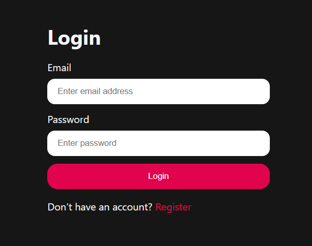
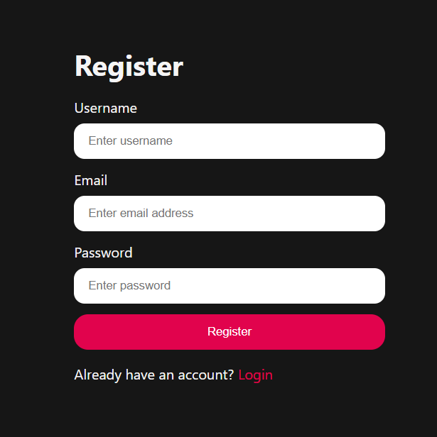
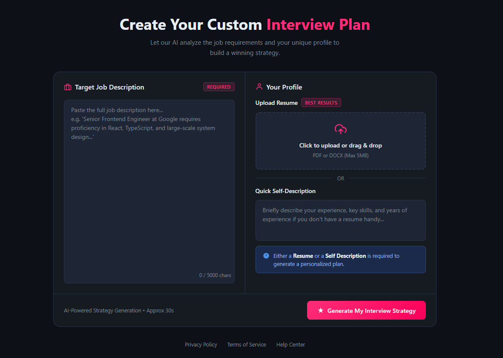
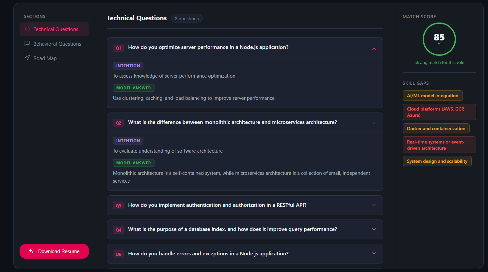

# 🚀 AI Interview Preparation Platform

An AI-powered web application that helps users prepare for interviews by generating personalized questions, analyzing responses, and identifying skill gaps.

---

## 📌 Features

- 🔐 User Authentication (Login & Register)
- 🧠 AI-generated Technical & Behavioral Questions
- 📊 Match Score based on user profile
- 🎯 Skill Gap Analysis
- 📄 Resume Upload or Self Description
- 💡 Model Answers with Intentions
- 🎨 Clean and Modern UI (Dark Theme)

---

## 🛠 Tech Stack

**Frontend:**

- React.js
- Tailwind CSS

**Backend:**

- Node.js
- Express.js

**Other:**

- Generative AI APIs
- MongoDB

---

## 📷 Screenshots

### 🔑 Login Page



### 📝 Register Page



### 🧠 Interview Plan Generator



### 📊 Dashboard (Questions & Analysis)



---

## ⚙️ Installation & Setup

```bash
# Clone the repository
git clone https://github.com/Harsh28Pandey/gen-ai-interview.git
```

# Navigate to project folder

```
cd gen-ai-interview
```

# Install dependencies

```
npm install
```

# Start the development server

```
npm run dev
```

---
